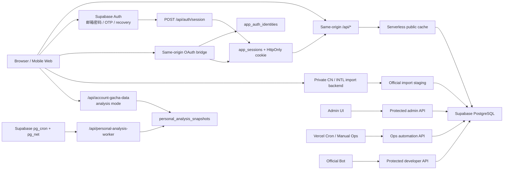

# Architecture

本文档描述当前 `v4.5.4` 主线架构，并单独标明当前工作树中已验收但未发布的桌面 Demo。历史计划和退役部署方式不再作为主路径记录；独立 CN / INTL 后端仅保留官方数据获取、规范化、内部暂存与原子写入职责。

## 1. 系统边界



- 公共数据：生产浏览器统一请求同源 `/api/*`，由 Serverless 层访问 Supabase。
- 私有数据：用户抽卡历史、个人排行、工单、账号恢复和后台数据保持鉴权隔离与 `no-store`。
- 认证：邮箱凭据继续由 Supabase Auth 管理；第三方 provider 经同源 OAuth bridge 接入，两条入口都以 `auth.users` UUID 为锚点并创建 `app_sessions`。`AUTH-HARDEN-001` Phase A–D、PR #14 和生产 166–168 已完成；LinuxDo 因无法申请 Connect Client 下调为 P3，保持关闭且不阻塞主线。
- 个人分析：浏览器只读取 owner/account 快照，不在请求期下载完整历史重新聚合。活跃用户通过 service-role-only RPC 排队并即时触发 `pg_net`，`pg_cron` 每分钟兜底；Worker 使用 lease / revision 防止并发覆盖和陈旧发布。
- 管理与自动化：后台写入、cron 和手动 ops 共享服务端 helper，写入成功后 best-effort 刷新公共缓存版本。
- 私有导入：CN / INTL 后端负责访问官方数据源、过滤情报书等非寻访事件、规范化、问题分类和内部暂存，随后自动通过数据库 RPC 原子提交；可定位的未知角色 / 武器记录写入后由 `history_anomalies` 提醒用户核对。再次导入时，只有被官方数据精确证明为非寻访事件的旧版四星未知占位才会原子移除并重算对应卡池保底。
- 仓库边界：`backend/` 只公开测试与数据契约需要的兼容 helper，不代表完整私有部署包。

## 2. 前端层

| 层级 | 主要文件 | 职责 |
|------|----------|------|
| 入口 | `src/main.jsx`、`src/AppRouter.jsx` | React 挂载、主题、双端路由、Speed Insights |
| 桌面端 | `src/App.jsx`、`src/GachaAnalyzer.jsx`、`src/components/app/DesktopAppRoutes.jsx` | 桌面壳层、初始化、主导航 |
| 移动端 | `src/mobile/MobileApp.jsx`、`src/mobile/layouts/MobileLayout.jsx` | 移动壳层、底栏、移动页面 |
| 状态 | `src/stores/*` | auth、pool、history、个人数据请求生命周期与个人分析快照 |
| 公共读取 | `src/services/publicResourceClient.js` | 同源请求、公共版本、内存缓存、localStorage snapshot |
| 私有读取 / 写入 | `src/services/accountGachaDataService.js`、`src/hooks/app/useCloudSync.js`、`src/utils/cloudDataSync.js` | 个人分析读取、历史分页、精确变更、池信息和 owner 隔离同步 |
| 官方导入 | `src/features/import/useOfficialImportController.js`、`src/features/import/ImportManager.jsx` | 创建 `import-full` 后台任务、轮询 `import-status`、结果刷新、导入后异常提示，以及兼容期遗留审阅元数据清理 |

当前仍需后续治理的前端复杂点：

- `SIM-004`：模拟器控制器仍承担过多 UI、资源、继承和分享状态。
- `ARCH-021`：桌面 / 移动端 dashboard、settings 仍有重复控制器逻辑。

### 2.1 本地桌面 Demo（2026-09-05 已本地提交，未推送 / 发布）

`GachaAnalyzer` 与 `DesktopAppRoutes` 仅在 Vite DEV 且 `home-demo=unified` 时选择新顶栏、`DesktopHomeDemo`、统一消息中心、个人工作区和页面动效。预览专用入口采用 DEV 条件懒加载，共享 `SummaryView`、图鉴和原生卡片继续兼容未传新增参数的原入口；移动布局保持原行为。界面预览开关不替代贡献者沙盒的数据隔离或现有认证权限。

`DesktopPersonalWorkspace` 把 `/dashboard` 分为个人概览与卡池分析：前者在 `PersonalDataBoundary` 内复用 `SummaryView lockedDataSource="local"`，后者保留原卡池工作区。预览 `/summary` 直接使用 `lockedDataSource="global"`，不受个人读取状态阻塞。图鉴同样锁定来源，个人概览不再等待无关全服加载；这里没有新增统计计算器、修改 schema v2 或重新开放跨账号汇总。

`desktopPageLayout.css` 统一预览壳层的 1366px 最大宽度、个人菜单和减少动态效果；首页通过固定卡片区与可伸展引导区适配 1366×768，较小容器使用分区页签。`DesktopPageMotion` 以路径和个人 `view` 管理入场 / 滚动重置，其他查询参数不触发整页重挂载。

`DesktopMessageCenter` 与 `desktopMessageModel` 统一四类公告 / 通知呈现，继续使用现有持久通知数据及业务回调。`VersionCountdownCard` 只接收日期、名称和动作，通过独立 `--vc-*` 主题变量适配视觉，不与版本宣传素材或宿主 Store 耦合。详细合同与验证边界见 [DESKTOP_HOME_DEMO.md](DESKTOP_HOME_DEMO.md)。

## 3. API 层

| 路径 | 入口 | 说明 |
|------|------|------|
| `/api/*` | `api/router.js` + `api/_routes/index.js` | Vercel 单入口，规避函数数量膨胀 |
| 公共 API | `api/_routes/root/bootstrap.js`、`announcements.js`、`stats.js`、`pool-rosters.js` | 公共数据读取和缓存 meta |
| 后台 API | `api/_routes/root/admin.js` | 管理面板统一入口 |
| 自动化 API | `api/_routes/root/ops-automation.js`、`api/_lib/runOpsAutomation.js` | cron、manual、job graph、review bundle |
| BOT / 开发者 API | `api/_routes/dev/**/*`、`api/_routes/integrations/**/*` | 受保护只读接口和平台绑定 |
| 账号历史与个人分析 | `api/_routes/root/account-gacha-data.js` | 私有历史分页、owner/account 快照投影、活跃排队、精确编辑 / 删除和别名解析 |
| 个人分析 Worker | `api/_routes/root/personal-analysis-worker.js`、`api/_lib/personalAnalysisWorker.js` | 受保护 Worker、按用户领取 owner/scope、构建并发布 revision 快照 |
| 历史异常 | `api/_routes/root/history-anomalies.js`、`admin-history-anomalies.js` | 用户当前作用域提醒与超级管理员复核 |
| 认证与会话 | `api/_routes/root/auth-oauth.js`、`api/_lib/linuxDoOAuth.js`、`auth-session.js`、`account-email-action.js`、`account-email-verify.js`、`account-password-setup.js`、`account-security-state.js` | OAuth transaction、GitHub/LinuxDo provider 编排、统一站点 Session、邮箱归属、首次设密与凭据状态 |

公共 API 的兼容响应字段保留 `success / data / cached / partial`，新增 `meta.source / meta.age / meta.partial / meta.stale / meta.cacheKey / meta.cacheVersion` 用于诊断。

## 4. 公共缓存与刷新

- 服务端缓存 helper：`api/_lib/publicCache.js`。
- 全局版本源：`site_config.public_cache_epoch`。
- 版本读取：`/api/public-cache-version`，响应 `no-store`。
- 显式刷新：`/api/admin-public-cache-bump` 和写入侧 best-effort bump。
- 前端降级：公共读取失败时使用最近一次 localStorage snapshot；生产环境不默认回退到 Supabase 浏览器直连。

公共缓存只覆盖首屏、公告、全服统计、卡池目录、阵容和公开 catalog。用户私有数据、后台数据、个人排行和恢复工单不得进入该缓存层。

## 5. 数据库层

Supabase 目录采用“baseline + 归档迁移 + 手工脚本”结构：

- `supabase/baseline/000_complete_schema.sql`：新环境唯一默认入口。
- `supabase/archive/migrations/`：已合并进 baseline 的标准迁移，仅用于审计和重建 baseline。
- `supabase/migrations/`：未来新增且尚未合并的前向迁移。
- `supabase/manual/`：危险、回滚、回填和历史诊断脚本，不进默认部署链。

DB-OPTIMIZE-001 的当前结论：线上 `history` 体积主要来自索引，字段或索引删除需要先完成查询计划、读写路径、回滚脚本和线上基准。本轮只整理迁移归档与 baseline，不直接改变生产 schema 语义。

异常核对与官方导入内部提交基础由迁移 152、153 提供：`history_anomalies` 记录待核对作用域，`history_change_log` 保存受控变更审计，`official_import_tasks` / `official_import_staged_records` 保存短期内部暂存任务，`commit_official_import_records()` 负责最终原子提交。`v4.5.4` 主路径由浏览器创建 `import-full` 后台任务，服务端过滤情报书等非寻访事件，完成安全分类、内部暂存和自动原子提交，浏览器只轮询 `import-status`，不调用同步 `import-confirm`。可精确定位的未知角色 / 武器记录写入并创建异常标记，缺少安全归属字段的记录跳过；迁移 157 提供 service-role-only 的精确修复 RPC，仅在历史记录与待处理异常的账号、区服、卡池、官方序号、时间和四星未知占位条件全部吻合时删除旧错误占位并重算保底。旧逐条审阅接口仅作为兼容接口保留。迁移 155 为旧客户端的仅 ID 批量删除增加锁定快照与重复作用域拒绝，新的单条和整组删除仍使用完整记录作用域。私有历史响应始终 `no-store`，不得进入公共缓存或公开统计快照。

账号历史读取先取得用户精确记录数，再以固定并发分页读取必要列；卡池目录、可见池和账号历史在前端同步阶段并行等待。该优化不改变完整作用域定位、审计或保底重算语义。

认证数据库面由 166–172 提供：admin RPC 权限、OAuth transaction、Session 撤销、规范化邮箱唯一归属、一次性邮箱 challenge、首次设密能力、临时凭据认证层门禁、版本化 identity hash keyring，以及受审批 / 证据约束的旧邮箱空壳修复与原子隔离。已确认生产历史包括 166–168；后续运行态仍以实时核验为准，不能仅由 Git 文件推定。

个人分析数据库面由 173–180 提供：owner/scope revision、快照队列、catalog 依赖失效、活跃用户优先级、Worker lease、`pg_cron + pg_net` 调度、5 秒全局节流和优先级感知即时派发。常规 Worker 保持 `PERSONAL_ANALYSIS_WORKER_BACKFILL_ENABLED=false`，历史回填只能在维护窗口显式开启。

附加寻访数据库面由 181–183 提供：`extra_subtype / extra_rule_profile / extra_series_key / extra_series_phase`，并把产品语义区分为 `reconstruction`、`reconstruction_claim` 和 `special`。相同分类贯穿可见卡池 RPC、管理写入、官方导入、版本绑定、分析与模拟器；旧 `type=extra` 仍作为粗粒度兼容类型。

## 6. 运营自动化

`OPS-006` 当前 graph：


每个节点记录依赖、输入源、输出摘要、耗时、attempts、failureType、warnings、cacheInvalidation、requiresReview 和 published。数据库仍复用 `ops_automation_runs`，`status` 只使用 `success / failure / skipped`；“部分成功”由 `summary.ops.presentationStatus = "partial"` 派生。

## 7. 可观测性与体积预算

- 前端观测：`@vercel/analytics`、`@vercel/speed-insights`。
- 构建预算：`npm run perf:report`。
- 公共网络边界：`npm run test:public-api-boundary`。
- 资源治理：大图优先压缩为 Web 友好格式，截图只保留 README 所需视图；字体 source 与 generated subset 分层维护。
- 已知热点：Serverless 分享图依赖 Chromium，Vercel output 体积仍需长期观察。

## 8. 验证入口

```bash
npm test
npm run test:unit
npm run lint
npm run build
npm run perf:report
npm run test:supabase-baseline
npm run test:supabase-baseline:smoke
npm run test:personal-analysis-queue
npm run test:auth-hardening-phase-a
npm run test:auth-hardening-phase-cd
npm run test:public-api-boundary
```
