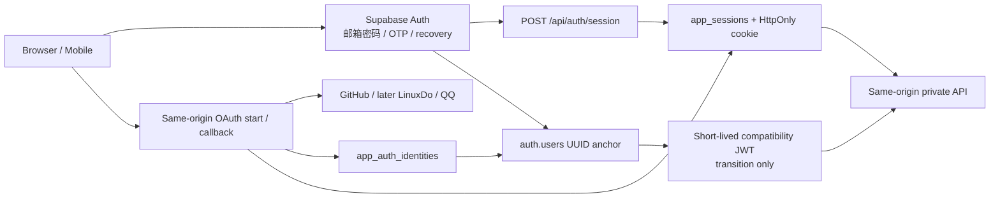

# 统一认证架构与安全加固计划

状态：2026-08-02 进度同步。本文记录当前事实、目标不变量和实施顺序；本地代码候选不等于已发布或允许部署。

> 新会话入口：根目录 `SESSION_HANDOFF.md` 与 `todo` 的 `AUTH-HARDEN-001`。
> 实现目录：`D:\Learning\Endfield Gacha\_tmp\auth-hardening-integration`（分支 `fix/auth-hardening-integration`）。
> Phase A、B、C、D 已集成到最新主线并重编号为 166/167；**未 commit / 未 push / 未部署 / 未执行生产 migration**。
> 隔离本地 Supabase/PostgreSQL 17、普通测试账号和隔离 GitHub OAuth App 已完成登录、绑定、解绑、解绑后拒绝与重绑核心浏览器闭环；提交前完整验证、发布和生产验证仍未完成。

## 当前决策

1. **保留正常邮箱注册主链。** 邮箱注册、密码登录、邮件验证码登录、密码找回和站内邮箱验证继续使用 Supabase Auth 与现有同源邮件入口；本轮不推翻这条主链。
2. **保留统一同源认证出口。** GitHub、后续 LinuxDo / QQ 等第三方 provider 仍由本站 OAuth bridge 接入，最终与邮箱登录共同落到 `app_sessions` 和 HttpOnly 站点 Cookie。Supabase `auth.users` 继续作为稳定用户 UUID 与邮箱密码锚点。
3. **先加固公共认证基础设施，再恢复 provider 扩展。** LinuxDo 现有实现曾无法稳定完成真实登录，本轮不修 LinuxDo provider 细节，也不把它描述为可用；完成公共 OAuth、会话、邮箱和凭据生命周期加固后再重新实现、验证。
4. **冻结认证相关生产变更。** 加固完成、测试通过并获得单独授权前，不推送认证候选实现、不执行认证迁移、不运行账号修复脚本的真实执行模式、不修改生产 Auth 用户或账号归属。

## 当前仓库事实

- 生产版本仍是 `v4.5.4`；主站标准迁移链与主站 baseline 到 158。共享生产库另有独立抽奖项目迁移 160–165，这些迁移不属于主站 baseline，也不得复制或重复执行。
- 远端 `origin/main` 当前为 `4826b76`（PR #13 合并提交）。
- 主工作树仍检出 `feat/perf-013-history-scope` @ `2a4f909`，有大量用户改动和已完成的认证文档改动；**不要在这棵树上实现认证代码**。
- **认证集成 worktree（当前唯一提交候选）：**
  - 路径：`D:\Learning\Endfield Gacha\_tmp\auth-hardening-integration`
  - 分支：`fix/auth-hardening-integration`
  - 基线 HEAD：`4826b76`（最新 `origin/main`）
  - 状态：Phase A–D 已集成到最新主线并重编号为 166/167；未 commit、未 push、未部署
- `.agent-tmp/oauth-password-email-conflict` 是已注册的 `fix/oauth-password-email-conflict` worktree @ `ea7466a`，含未提交邮箱目标绑定、首次设密和遗留冲突修复候选；仅作参考，不是实现基线。
- 命令工具对 `_tmp/*` / `.agent-tmp/*` 的 `working_directory` 可能错误回退到主工作树。Git 使用 `git -C "D:\Learning\Endfield Gacha\_tmp\auth-hardening-integration"`；npm 使用 `npm --prefix "D:\Learning\Endfield Gacha\_tmp\auth-hardening-integration"`。
- `origin/main` 的主站标准迁移尾号是 158；这不等同于共享生产数据库的全局迁移尾号。认证候选尚未执行生产迁移。

### migration 编号的跨 worktree 冲突（不是同分支重复文件）

| 位置 | 文件名 | 含义 |
| --- | --- | --- |
| 认证集成 worktree | `166_harden_admin_profile_and_oauth_transactions.sql` | Phase A/B forward migration；已避开抽奖 160–165 |
| 认证集成 worktree | `167_harden_account_credentials_and_identity_keys.sql` | Phase C/D forward migration；紧随 Phase A/B |
| 主脏树性能线 | `159_add_history_scope_read_models.sql` | 本地性能 RPC/索引；**不得部署**；合入前必须重编号 |
| 邮箱候选 worktree | `159_bind_email_verification_to_target.sql` | Phase C 参考候选；**不得部署**；合入前必须重编号 |

- 2026-08-02 已通过 `ssh.secret` 只读核对生产 schema：运行版本为 `v4.5.4`，抽奖 160–165 的代表性结构全部存在，性能 159 与认证 Phase A–D 结构均不存在；生产库没有主站应用级 migration ledger。
- 因此认证两条迁移使用连续新号 166/167。性能线 159 和旧邮箱候选 159 仍是独立未发布候选，不进入本认证分支。
- 编号只表示发布顺序；生产应用仍需单独授权，并按 166 → 167 执行。

## 实现进度

| 阶段 | 状态 |
| --- | --- |
| 文档 / 任务账本 / 交接 | 已同步到 2026-08-02 实现与浏览器证据 |
| 认证实现 worktree | 已创建；含未提交 Phase A–D 候选 |
| Phase A 代码（admin RPC + OAuth transaction） | **本地完成，未 commit** |
| Phase B 代码（双凭据、刷新凭据、session 撤销、兼容 JWT 回查） | **本地完成，未 commit** |
| Phase C 代码（候选邮箱、首次设密、临时密码到期） | **本地完成，未 commit** |
| Phase D 代码（identity keyring、原子认领、补偿恢复） | **本地完成，未 commit** |
| Phase E（GitHub 真实浏览器回归） | 核心闭环已完成；取消授权、跨浏览器 transaction、link Session 切换和 callback 重放仍缺独立真人浏览器证据 |
| LinuxDo 重新实现 | 暂缓 |
| push / 部署 / 生产 migration / 生产账号修复 | 未授权 |

## 认证数据流

这不是两套互不相干的账号系统：邮箱和第三方登录拥有不同入口，但必须解析到同一个站点用户 UUID，并通过同一会话边界访问私有 API。

## 必须长期成立的不变量

- 一个 provider 的稳定 subject 只能归属一个站点用户；普通登录、绑定和重试不得改写已经存在的 owner。
- OAuth transaction 必须绑定发起浏览器；`link` 还必须绑定发起时的同一站点 session 和 user，并只能消费一次。
- 持久 provider identity key 必须使用独立、版本化、可迁移的密钥，不能依赖用于短期 `state` 签名的密钥。
- 同一请求同时出现站点 Cookie 和 Bearer token 时，两者 user ID 必须一致；不一致时拒绝，而不是静默选择其中一个。
- `profiles.email` 不能成为未验证邮箱的永久归属声明。候选邮箱应有独立 pending 状态，只有完成目标邮箱验证和 Auth 绑定后才成为 canonical email。
- “已验证”必须同时满足：用户、规范化目标邮箱、challenge、版本和消费状态一致。仅有 `verified_at` 时间戳不构成邮箱所有权证明。
- 解绑登录方式提交后必须至少保留一种真实可用方式：已验证且已绑定 Auth 的邮箱密码，或另一条活动 OAuth identity。
- 首次设置密码、临时密码修改和恢复 token 都必须是一次性能力；部分成功不能留下可重复使用的免旧密码入口。
- 密码修改、密码找回和管理员重置后，旧站点 session、其他设备 session 与相关兼容 token 必须按策略撤销。
- 标注为“临时”的密码必须在认证层真正失效；业务表中的到期时间和设置页提示不能代替认证执行。

## 本地候选已修复、仍待发布验收的问题

### 第一组：直接攻击面

- ~~OAuth `state` 未绑定发起浏览器或站点 session~~ → **本地已修**：transaction + 浏览器绑定 Cookie + 原子 DELETE 消费 + PKCE。
- ~~`admin_update_profile` 对普通角色开放并信任 actor UUID~~ → **本地已修**：migration 166 撤销 `PUBLIC/anon/authenticated` EXECUTE，仅 service-role。

### 第二组：身份一致性与锁号

- ~~Cookie 与 Bearer 属于不同用户时静默优先 Cookie~~ → **本地已修**：同时存在时校验两边并比较 user ID；冲突返回 `auth_identity_conflict`。bootstrap 只认 Bearer。
- ~~未验证、未绑定 Auth、未设置密码的 profile 邮箱会被当作备用登录方式，可能允许解绑最后一个 OAuth identity~~ → **本地已修**：解绑走 `unlink_oauth_identity_atomically`，在用户级锁内按“活动 OAuth identity 数 + Auth 确认邮箱密码”判定，提交后必然保留一种可用方式。
- ~~候选邮箱在验证前写入 `profiles.email`，而 profile 邮箱缺少规范化唯一归属模型~~ → **本地已修**：migration 167 引入 `account_email_ownerships`（规范化唯一归属）与 `account_email_challenges`（一次性挑战），验证成功后才提升 canonical。
- ~~OAuth identity 认领依赖先查后 upsert；并发时可能改写 owner。首次创建 Auth user 后 identity 写入失败也缺少幂等恢复~~ → **本地已修**：`claim_oauth_identity` 原子认领（owner 不可变、hash split 拒绝）；创建前先按新旧 synthetic email 恢复半成品 Auth user，profile 缺失时修复，孤儿清理只针对本次新建。

### 第三组：凭据生命周期

- ~~临时密码到期时间目前只是业务元数据；通用状态清除接口也不要求密码实际已修改~~ → **本地已修**：`auth.sessions` 插入/更新前与站点 session/Bearer 解析均执行认证层到期检查；`clear_password_change_required` 用户入口已删除；管理员发放临时密码时到期状态随 Auth 更新原子写入。
- ~~改密/找回/管理员重置后不撤销旧 `app_sessions`；兼容 JWT 不回查活动 session~~ → **本地已修**：`revokeAllSiteSessionsForUser` + `POST /api/auth/session/revoke-all`；兼容 JWT 回查 `session_id` 对应活动行。
- ~~OAuth 首次设密在 Auth 更新成功、状态清理失败时，可能继续保留免旧密码能力~~ → **本地已修**：一次性能力先原子 claim；Auth 更新失败或收尾失败均进入 `coordination_required`，不再重新开放免旧密码入口。
- ~~首次设密与邮箱补录跨 Supabase Auth 和业务表，最终检查后仍存在并发提交窗口~~ → **本地已修**：challenge/能力状态机全部在数据库 RPC 内以 advisory lock + 条件更新完成单次消费。

### 第四组：密钥演进

- ~~provider subject hash 当前与 `OAUTH_STATE_SECRET` 耦合。轮换短期 state 密钥会使同一 provider 用户生成新的 identity key，并可能进入新的站点账号~~ → **本地已修**：独立 `AUTH_IDENTITY_HASH_KEY_CURRENT/PREVIOUS` keyring（缺 key 安全关闭，版本冲突拒绝）；登录时按新旧 hash 双读并原子迁移，identity 的 hash/版本字段不可直接改写。

## 已确认可以保留的设计

- GitHub provider email 不再直接作为站点可信邮箱。
- OAuth Auth 用户使用内部合成邮箱，避免 provider email 自动成为密码找回地址。
- Auth 用户、profile、站点 identity 与 session 都以同一个用户 UUID 为锚点。
- 邮箱验证码和验证链接只保存 hash，并带用户和有效期边界。
- 候选实现引入精确验证目标邮箱的方向正确；合入后仍需用一次性版本/CAS 处理并发和部分成功。
- `app_auth_identities`、`app_sessions`、认证审计表保持 service-role-only，普通浏览器不得直接写入。
- 正常邮箱注册在 profile 或安全状态建立失败时执行收容，避免返回一个表面成功但初始化不完整的账号。

## 分阶段实施顺序

### Phase A：关闭直接攻击面

**本地实现状态：已完成（未 commit）。**

1. migration `166_harden_admin_profile_and_oauth_transactions.sql`：
   - 撤销 `PUBLIC/anon/authenticated` 对 `admin_update_profile` 的 EXECUTE；仅 `service_role`
   - 表 `app_oauth_transactions` + 过期清理 + 条件 `DELETE` 单次消费
   - 用户级 session 撤销状态 / RPC 边界（Auth 邮箱或密码真实变化时撤销活动站点 session）
   - OAuth identity owner 不可改写触发器
   - 原生 Bearer bootstrap 幂等与活动 session 容量边界（见 migration 正文注释）
2. OAuth 应用层：浏览器绑定 Cookie + PKCE S256；`intent=link` 校验发起 session+user。
3. 回归：PostgreSQL 17 权限脚本、OAuth 跨浏览器/重放/跨 session、link 同用户等。

关键文件：`supabase/migrations/166_*.sql`、`api/_lib/oauthState.js`、`api/_routes/root/auth-oauth.js`、`api/_lib/oauthProviders.js`、`scripts/verify-auth-hardening-phase-a.mjs`

### Phase B：统一请求身份与凭据撤销

**本地实现状态：已完成（未 commit）。**

1. `POST /api/auth/session` bootstrap 只走 `resolveBearerRequestUser`；已有 Cookie 不能覆盖待引导用户。
2. `resolveAuthenticatedRequestUser`：有 Authorization 时先校验 Bearer；若同时有有效 Cookie session，比较 user ID，不一致返回 `auth_identity_conflict`。
3. `revokeAllSiteSessionsForUser` + `POST /api/auth/session/revoke-all`；接入 OAuth 首次设密、管理员重置、恢复临时密码、普通改密与找回改密收尾。
4. 兼容 JWT（`app_metadata.provider=site_session`）解码 `session_id` 后回查 `app_sessions` 活动状态。
5. 刷新凭据 Cookie 默认 `__Secure-eg_refresh` + `Path=/api/auth/session`；旧 `__Host-` 配置名自动规范化；rotation 条件更新绑定旧 refresh hash。

关键文件：`api/_lib/siteAuth.js`、`api/_lib/siteSession.js`、`api/_routes/root/auth-session.js`、`account-password-setup.js`、`admin.js`、`src/services/siteSessionService.js`、`accountSecurityService.js`、`ResetPasswordPage.jsx`

### Phase C：收敛邮箱与密码状态机

**本地实现状态：已完成（未 commit）。**

1. 建立规范化候选邮箱/pending 状态；验证前不把候选值写成 canonical `profiles.email`。migration 167 新增 `account_email_ownerships`（规范化唯一归属）与 `account_email_challenges`（一次性挑战，绑定 `user_id + target_email + 版本`，`start/consume` RPC 以 advisory lock + 条件更新保证单次消费）。
2. 邮箱归属使用数据库唯一约束或原子 claim，不用全量扫描 Auth 用户替代唯一性。
3. challenge 绑定 `user_id + target_email + version`，验证和首次设密都使用条件消费。
4. 首次设密先原子占用一次性能力（`available→claimed→completed/coordination_required`）；Auth 更新失败或收尾失败均不再重新开放免旧密码更新。
5. 解绑 OAuth identity 走 `unlink_oauth_identity_atomically`，在用户级锁内检查提交后的真实登录方式。
6. 临时密码在认证层真实到期（`auth.sessions` 门禁 + 站点 session/Bearer 校验）；删除普通用户可直接清状态的入口；管理员发放临时密码时到期状态随 Auth 更新原子写入（`app_metadata` + 触发器同步）。
7. `has_verified_password_login` 在数据库内统一核对 Auth 密码、确认邮箱、profile 邮箱和私有邮箱归属；OAuth 登录与原子解绑不再依赖 Admin API 是否返回密码哈希。

关键文件：`supabase/migrations/167_harden_account_credentials_and_identity_keys.sql`、`api/_routes/root/account-email-action.js`、`account-email-verify.js`、`account-password-setup.js`、`account-security-state.js`、`admin.js`、`api/_lib/siteSession.js`、`siteAuth.js`、`scripts/verify-auth-hardening-phase-cd.mjs`

### Phase D：稳定 OAuth identity

**本地实现状态：已完成（未 commit）。**

1. 引入独立、版本化的 identity hash key：`api/_lib/identityHash.js`（`AUTH_IDENTITY_HASH_KEY_CURRENT/PREVIOUS`，缺 key 安全关闭、版本冲突拒绝，与 state 密钥解耦）。
2. 支持旧 key 查询、新 key 写入和登录时原子迁移（`claim_oauth_identity` RPC 双 hash 双读，owner 不可变、hash split 拒绝）；迁移完成前不得轮换/退役旧 key。
3. identity claim 使用受控 RPC，冲突时只读取已有 owner；identity 的 owner/provider/hash/版本字段不可直接改写（触发器门禁）。
4. Auth user 创建与 identity 写入增加补偿和幂等恢复：按新旧 synthetic email 恢复半成品，profile 缺失时修复，孤儿清理只针对本次新建。
5. token/profile 请求使用稳定错误码、15 秒超时和有限重试；服务端 OAuth 环境代理仅在 `AUTH_OAUTH_USE_ENV_PROXY=true` 时启用，并尊重 `NO_PROXY`。

### Phase E：provider 恢复顺序

1. GitHub 核心浏览器闭环已完成：登录原账号、绑定、软解绑、解绑后拒绝和恢复原 identity。
2. 继续补取消授权、跨浏览器 transaction、link Session 切换和 callback 重放的独立真人浏览器证据；GitHub 已授权 scope 不显示拒绝控件时如实记录 provider 限制。
3. 再重新实现并验证 LinuxDo；不要直接复用先前无法正确登录的实现作为“已完成”基础。
4. LinuxDo 验收需覆盖登录、绑定、解绑、重绑、取消、错误配置、邮箱缺失和账号冲突。
5. QQ 保持关闭，等待平台审核和真实回调格式确认。

## 邮箱主链验收

邮箱主链不因 OAuth 加固而停用，但发布前必须覆盖：

- 新邮箱注册、重复邮箱、profile 初始化失败收容；
- 密码登录、错误密码、Cookie/Bearer 一致性；
- 邮件验证码登录和不存在邮箱的通用响应；
- 密码找回、密码更新后旧 session 撤销；
- 站内邮箱验证的目标绑定、过期、重放和并发换绑；
- 邮件发送失败时的持久化状态与用户提示；
- 普通邮箱双确认完成后的 Auth/profile/security-state 一致性。

## 迁移与发布闸门

1. `origin/main` 的主站标准迁移链仍到 158；共享生产 schema 已只读确认抽奖 160–165 存在，认证最终 migration 为 166/167，均未生产应用。
2. 性能线 `159_add_history_scope_read_models.sql` 与旧邮箱候选 `159_bind_email_verification_to_target.sql` 仍位于其他 worktree，未进入本分支、未生产应用。
3. 最终集成树必须重新生成 baseline 到 167，并通过静态校验、临时 PostgreSQL 完整执行与认证 PostgreSQL 17 专项。真实空库验证还覆盖历史工单迁移在表不存在时的清理顺序，以及 `service_role` 对 profiles / 私有 Session 撤销状态的最小权限。
4. 数据库迁移先于依赖新列/新 RPC 的 API 代码部署。
5. 先在关闭第三方 provider 和真实账号修复的状态下部署基础设施，再逐项做小范围真实测试。
6. GitHub 核心验收已完成，可在认证主线集成边界明确后进入 LinuxDo 实现；LinuxDo 验收前保持前后端开关关闭。
7. 生产账号定向修复必须单独申请授权，并先重新运行只读演练；提交、推送或部署授权不自动包含账号修改授权。

### 本地验证快照（2026-08-02，认证集成 worktree）

- 全量 Vitest：181 文件 / 976 测试全部通过
- ESLint：通过
- 生产构建：通过
- `test:auth-hardening-phase-a`（PostgreSQL 17）：admin RPC 权限、transaction 单次删除消费、过期清理、owner 不可变、session 撤销、Bearer bootstrap 幂等通过
- `test:auth-hardening-phase-cd`（PostgreSQL 17）：邮箱挑战单次消费/重放=0/唯一 owner、首次设密能力重放拒绝、过期临时密码拒绝（含 `auth.sessions` 门禁）、管理员临时凭据原子状态、identity 旧 key 迁移与字段防改写、原子解绑通过
- `test:supabase-baseline` / `test:supabase-baseline:smoke`：通过；验证 `service_role` profile/撤销状态权限与浏览器角色拒绝
- 本地 Supabase/PostgreSQL 17：candidate baseline 从空库完整导入；普通测试账号的邮箱确认、密码、profile、唯一邮箱归属以及“密码登录 → 站点 Session → 当前用户 → 注销”链路通过
- GitHub OAuth/Session 专项 41 项通过；数据库密码备用登录判定、稳定网络错误码、15 秒超时、有限重试、显式环境代理和 `NO_PROXY` 旁路有回归断言
- 当前本地站点使用 `http://127.0.0.1:5173`；隔离账号已完成“绑定 → GitHub 登录同一账号 → 软解绑 → 邮箱密码仍可登录 → `oauth_identity_unlinked` → 重绑恢复原 identity ID/owner”
- MaaMCP 操作 Firefox 复验退出、GitHub 登录和官方账户选择器；最终为 1 个 user、1 条活动 identity、1 条活动 Session、0 个待处理 transaction
- GitHub 已授权状态下官方账户选择器没有取消/拒绝控件；浏览器后退未重新请求 302 callback，因此没有把它冒充取消或重放通过
- 仍未：commit、push、部署、生产 migration、生产账号修改，以及取消授权/跨浏览器/link Session 切换/callback 重放的独立真人浏览器证据

## 文档职责

- 本文：认证目标架构、风险、实施顺序和验收门禁。
- `ARCHITECTURE.md`：全站系统边界和数据流。
- `PROJECT_GUIDE.md`：环境变量、部署和运维入口。
- `supabase/README.md`：迁移编号、baseline 和数据库执行规则。
- `SELF_HOSTED_MAIL.md`：邮件 provider、outbox、防刷和投递边界。
- `RELEASE_CHECKLIST.md`：每次认证发布必须逐项执行的检查清单。

历史交接、旧发布说明或旧邮件模板如果与本文冲突，以当前代码、实际 Git 状态和本文记录的“未完成”边界为准。
