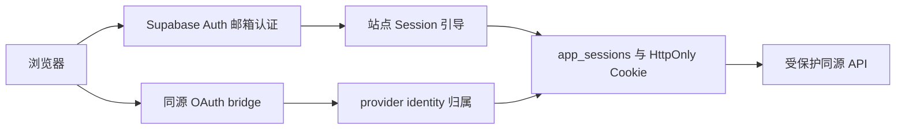

# 认证、身份归属与会话安全

本文说明贡献者修改登录、邮箱、密码、OAuth 和账号恢复时需要保持的合同。环境字段见 [.env.example](../.env.example)，数据库结构和安装顺序见 [Supabase 指南](../supabase/README.md)。

## 认证入口

邮箱凭据由 Supabase Auth 管理；第三方登录经过本站同源 OAuth bridge。两种入口最终以同一个 `auth.users` UUID 为账号锚点，通过 `app_sessions` 和 HttpOnly Cookie 访问私有 API。


```mermaid
flowchart LR
  Browser[浏览器] --> Email[Supabase Auth 邮箱认证]
  Browser --> OAuth[同源 OAuth bridge]
  Email --> Bootstrap[站点 Session 引导]
  OAuth --> Identity[provider identity 归属]
  Bootstrap --> Session[app_sessions 与 HttpOnly Cookie]
  Identity --> Session
  Session --> Api[受保护同源 API]
```

相关入口：`api/_lib/siteAuth.js`、`siteSession.js`、`identityHash.js`、`oauthState.js`、`api/_routes/root/auth-oauth.js`、`auth-session.js`。

## 身份与 OAuth

- 一个 provider 的稳定 subject 只能归属一个站点用户。登录、绑定和重试不能改写已有 owner。
- OAuth transaction 绑定发起浏览器、PKCE 与短期 state；绑定操作还须核对发起时的 user／Session。callback 原子消费 transaction，过期或重放拒绝。
- 不把 provider 提供的邮箱自动视为本站已验证邮箱；OAuth 用户的内部合成邮箱不是找回密码地址。
- 请求同时带 Cookie 与 Bearer 时，两者解析的用户必须一致，不一致返回 `auth_identity_conflict`。Bearer 引导不能被已有 Cookie 覆盖。
- 登录或初始化部分失败时，只清理本次创建且可证明无有效归属的孤儿，不能删除已有真实账号。
- 解绑在数据库锁内检查实际可用登录方式，不允许移除最后一种方式；软解绑后直接登录返回 `oauth_identity_unlinked`，重绑恢复原归属。

provider 使用独立 adapter。GitHub、LinuxDo、QQ 的启用条件分别核验；LinuxDo 使用授权码、PKCE S256、Basic Token 鉴权和 Bearer UserInfo，默认保持关闭，取得有效 Client 并完成浏览器闭环后再启用。

## 邮箱、密码与一次性能力

未验证邮箱只作为 pending 目标。`account_email_ownerships` 维护规范化邮箱的唯一归属，`account_email_challenges` 绑定用户、目标、版本与有效期，验证成功后才更新 canonical 邮箱。

挑战消费、首次设密和归属变更使用数据库 advisory lock 与条件更新，保证并发下只成功一次。Auth 密码更新失败或状态不明确时进入协调状态，不能重新开放免旧密码能力。OAuth callback 与首次设密完成共用锁，并在锁内检查真实密码登录能力，避免旧 callback 回退已完成状态。

管理员临时凭据的到期元数据与密码更新原子写入。到期校验在 Auth Session 创建／刷新及站点凭据解析层执行；普通状态清除不能解除到期限制，真正改密才完成恢复。

账号恢复、未知邮箱的邮件登录和重置使用通用响应，避免枚举。投递失败保留可解释状态和人工恢复入口，邮件合同见 [SELF_HOSTED_MAIL](SELF_HOSTED_MAIL.md)。

## 会话撤销与直连边界

- 改密、邮箱真实变化、找回和管理员恢复撤销旧站点会话，原生 Auth Session 也受撤销状态和临时凭据门禁约束。
- 兼容 JWT 必须绑定可查询的活动 Session，不接受凭证自行派生的兼容会话。
- 刷新 Cookie 默认 `__Secure-eg_refresh`，路径限定 `/api/auth/session`；轮换和注销按凭据族加锁，旧／新 refresh 任一注销都撤销整个会话。
- 数据库撤销失败不能返回注销成功。仅剩刷新 Cookie 时仍要撤销数据库 Session。
- restrictive RLS 策略阻止撤销后的 JWT 绕过同源 API 直连表；身份、挑战、归属、审批与会话管理 RPC 保持服务端权限。
- 私有账号、个人分析与历史响应使用 `no-store`，不进入公共缓存。

## 密钥与网络

`OAUTH_STATE_SECRET` 只保护短期 OAuth state。持久 identity 使用独立的 `AUTH_IDENTITY_HASH_KEY_CURRENT/PREVIOUS` 与版本字段；迁移旧 identity 时按新旧 hash 双读，并在数据库锁内确认唯一 owner。hash 分裂或跨 owner 冲突拒绝，identity owner／hash／版本不能由普通更新改写。

`AUTH_IDENTITY_HASH_KEY_LEGACY_STATE` 只用于仍需迁移的旧 hash，完整迁移后才能移除。`APP_SESSION_SECRET` 与上述密钥分开配置，服务端秘密不写入 `VITE_*`。

OAuth 出站默认不读取系统代理，需要时显式设置 `AUTH_OAUTH_USE_ENV_PROXY`，并核对 `NO_PROXY`。请求保持超时、有限重试和稳定脱敏错误码，不把 token 或 provider 原始响应暴露给用户。

## 旧邮箱空壳修复

迁移 169–172 只处理符合已知旧故障证据的 email-only 空壳，不是通用账号合并。真实账号、MFA、额外身份、业务数据或不完整证据都继续拒绝。

修复需 operator 逐项批准不可变证据，用户在有效 OAuth Session 中控制目标邮箱、完成验证码并再次明确确认。发送和失败预算按源用户／目标邮箱持久累计，更换 intent 不能绕过限制。

claim 在数据库锁内重查证据、占用 intent、冻结空壳并撤销会话。消费过旧 Magic Link 的形态使用 `legacy_magiclink_consumed_v2`，核对完整 Auth／identity／Session／refresh／审计证据，不仅凭 bcrypt 外形判断。

迁移 172 将空壳用户、唯一 email identity 和 intent 状态原子隔离。跨 Auth API 与数据库结果不明时按最终状态做幂等核对，无法确定则进入人工协调；确认重试重建交接会话并撤销旧交接会话，不盲目释放 claim 或批量修复。

## 验证与发布

```bash
npm run test:auth-hardening-phase-a
npm run test:auth-hardening-phase-cd
npm run test:supabase-baseline
npm run test:supabase-baseline:smoke
```

专项覆盖管理员 RPC、transaction、owner、挑战单次消费、邮箱唯一归属、凭据到期、identity 迁移、会话撤销和并发。数据库真实验证之外，每个 provider 还需隔离账号的登录、绑定、解绑、重绑浏览器闭环；自动化或浏览器后退不替代未实际返回的 provider 取消事件。

数据库新字段／RPC 先于依赖代码部署。先验证关闭状态与权限，再逐项启用 provider；迁移与定向账号修复分别核对影响范围及回退措施。浏览器后台刷新锁是独立机制，见 [锁适配说明](SUPABASE_AUTH_LOCK_FIX.md)。
